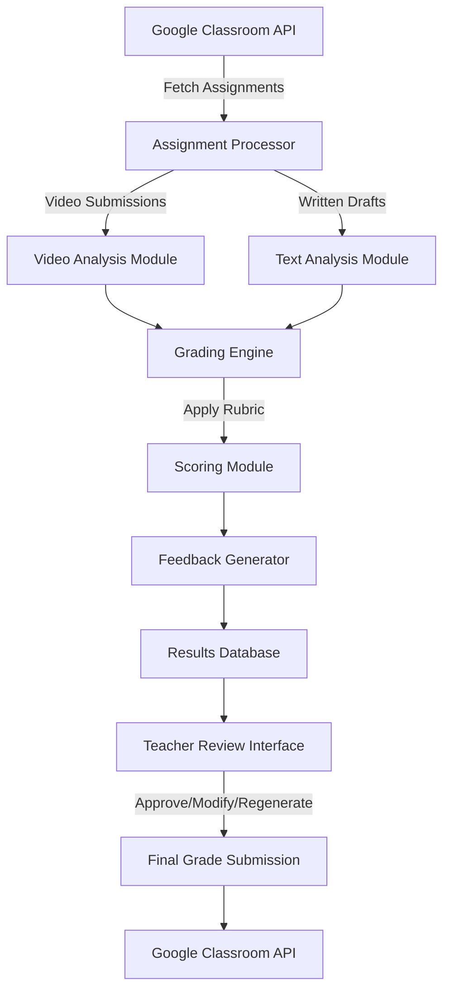

# Architecture

## System Context

```mermaid
graph TD
A[Google Classroom API] -->|Fetch Assignments| B[Assignment Processor]
B -->|Video Submissions| C[Video Analysis Module]
B -->|Written Drafts| D[Text Analysis Module]
C --> E[Grading Engine]
D --> E
E -->|Apply Rubric| F[Scoring Module]
F --> G[Feedback Generator]
G --> H[Results Database]
H --> I[Teacher Review Interface]
I -->|Approve/Modify/Regenerate| J[Final Grade Submission]
J --> K[Google Classroom API]
```
